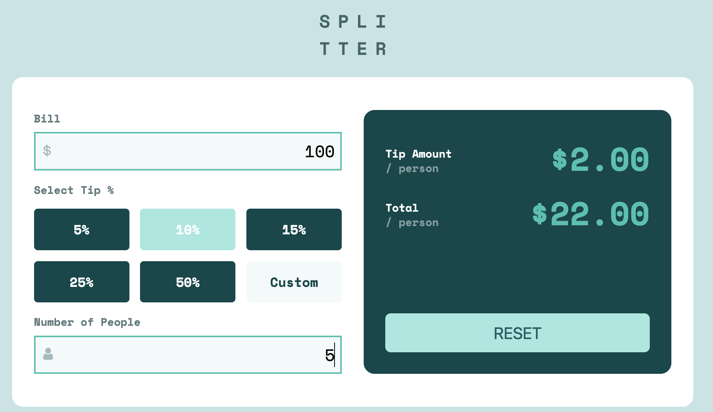
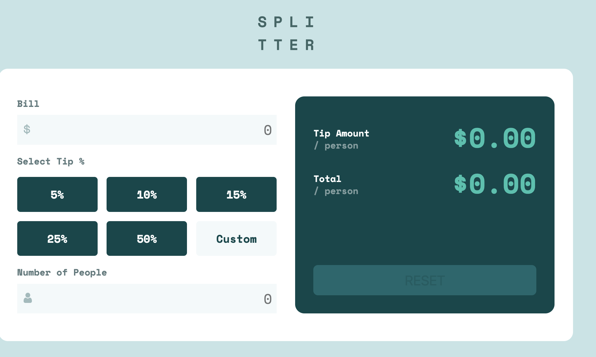

# Tip calculator app solution

## Table of contents

- [Overview](#overview)
  - [The challenge](#the-challenge)
  - [Screenshot](#screenshot)
  - [Links](#links)
- [My process](#my-process)
  - [Built with](#built-with)
  - [What I learned](#what-i-learned)
  - [Continued development](#continued-development)
  - [Useful resources](#useful-resources)
- [Author](#author)

## Overview

### The challenge
The challenge is to create a tip calculator. The user enters the amount of money, the percentage, and the number of people, and the screen displays the tip per person and the total tip per person.

### Screenshot
# calculator before reset with data

# calculator after reset 

### Links

## My process
I started by structuring the HTML, separating it into two parts: - the title   
- the calculator content, which is further divided into two sections.

In the design, I used a grid to have two equal columns in the desktop version and a single-column grid for the mobile version. I also used a grid for the button layout.

In the JavaScript logic, I started with the number inputs, where the user enters the information. I applied an input event to capture the user's input and assign it to a variable I created to store the result. For the buttons, I created a forach loop that iterates through them with a click event to determine which button the user is pressing and store that in a variable.

Finally, I created the function that dynamically calculates the result, calling it each time there is a new input, and the reset button, which is only activated when data has been entered to reset the calculator.
### Built with

- Semantic HTML5 markup
- CSS custom properties
- Flexbox
- CSS Grid
- Mobile-first workflow
- JS

### What I learned
In this project I've learned to master events and create functions for those events, and I've also learned to dynamically change HTML content with JavaScript.

### Continued development
In the future, I would like the calculator to be able to save data, as well as perform other types of calculations.

## Author
- github - sidi1999
- Frontend Mentor - sidi1999

